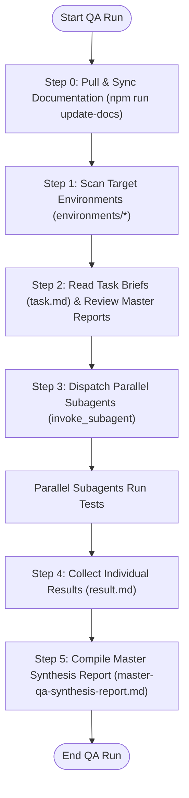
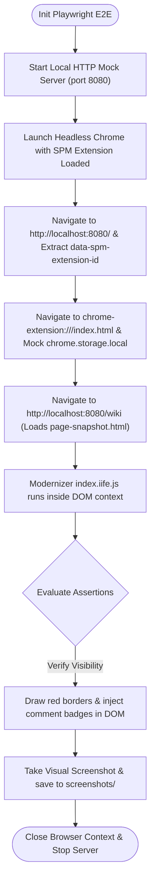

# SPM QA Test Suite & Orchestration Portal

This repository contains the Quality Assurance (QA) validation suite, target test environments, and automated E2E browser automation frameworks for the **Site Package Manager (SPM)** ecosystem.

---

## 1. QA Orchestrator Lifecycle

The QA Orchestrator is the central controller responsible for preparing documentation, validating syntax compiler configurations, and spawning isolated parallel environment testers.

### Orchestration Pipeline Flow



### Key Phases:
1. **Ecosystem Synchronization**: The orchestrator triggers `npm run update-docs` to gather Veneer Spec definitions, manifest schemas, command manuals, and React component specifications from `spm-cli` and `spm-components`.
2. **Parallel Dispatching**: Dispatches independent subagents concurrently per target site (e.g. `site-f-wiki`, `site-g-gallery`, `site-h-classifieds`), optimizing execution speed.
3. **Consolidation**: Gathers individual `result.md` files and updates the unified Master QA Synthesis Report.

---

## 2. E2E Browser Automation Flow

E2E testing guarantees that the browser extension compiles, intercepts network requests, injects Shadow DOM roots, and mounts React components correctly inside active tabs.

### E2E Automation Lifecycle



### Key Execution Pillars:
- **Sandbox Isolation**: Playwright mounts the dynamic React build output directly from `extension/dist/`.
- **Zero-Internet Dependency**: Intercepted pages are served locally on `localhost:8080` using Node's native `http` module, resolving Playwright's content-script injection limitations.
- **Visual Annotations & Highlights**: The test suite inspects elements, injects overlay comment badges directly into the webpage, and captures visual evidence stored under `/screenshots/`.

---

## 3. Getting Started

### Prerequisites
Make sure you have Node.js (v18+) installed.

### Installation
Install test suite dependencies:
```bash
npm install
```

### Synchronize Documentation
Pull and rebuild central reference documentation:
```bash
npm run update-docs
```

### Execute E2E Tests
Run the Playwright E2E test suite:
```bash
npm run test:e2e
```
