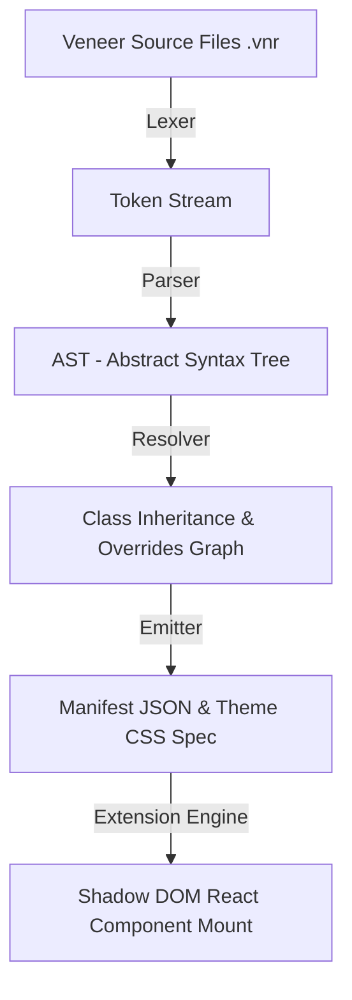

# Complete Veneer Specification Language (`.vnr`) Reference Manual

The Veneer Specification Language (`.vnr`) is a declarative domain-specific language (DSL) compiled by `spm-cli` into Site Package Manager (SPM) JSON manifest specifications. It powers all site modernization across the SPM extension ecosystem.

---

## 1. Compiler Architecture & Execution Pipeline



### Compiler Subcommands (`spm-cli`)
- `spm dev`: Runs local hot-reloading dev server compiling `.vnr` files in memory.
- `spm compile`: Compiles `.vnr` project directory into target `manifest.json`.

---

## 2. Keywords & Language Directives

### A. `theme` Block
Defines visual design tokens (CSS custom properties) and custom global CSS rules for a target site:
```vnr
theme "Dark Modern Algolia" {
  variables {
    --spm-bg-primary: "#09090b";
    --spm-bg-surface: "#121215";
    --spm-bg-element: "#18181b";
    --spm-text-primary: "#f4f4f5";
    --spm-text-muted: "#a1a1aa";
    --spm-accent: "#ff6600";
    --spm-border-contrast: "rgba(255, 255, 255, 0.08)";
  }

  customStyles {
    "body { background-color: #09090b !important; color: #f4f4f5 !important; font-family: 'Inter', sans-serif !important; }"
  }
}
```

---

### B. `class` Blueprint & Single Inheritance (`extends`)
Classes act as reusable data scraping models. Derived classes inherit all parent `bind` declarations and can override or extend bindings:

```vnr
class BaseSearchResultItem {
  bind title: ".Story_title a | text";
  bind url: ".Story_title a | attr:href";
  bind domain: ".Story_link | text";
}

// Derived Class extending BaseSearchResultItem
class DetailedSearchResultItem extends BaseSearchResultItem {
  bind points: ".Story_meta span:first-child | text";
  bind author: ".Story_meta a.hnuser | text";
  bind age: ".Story_meta span.age | text";
  bind commentsCount: ".Story_meta a:last-child | text";
}
```

#### Class Scope (`scope`)
Restricts all inner `bind` selectors to a specific sub-container:
```vnr
class UserProfileCard {
  scope: ".user-detail-box";

  bind avatarUrl: "img.user-avatar | attr:src";
  bind username: "h3.user-name | text";
}
```

---

### C. `bind` Directives & Extractor Operators
The `bind` directive connects component props to CSS selectors and DOM content extractor operators using the pipe (`|`) syntax:

```vnr
bind propName: "CSS_Selector | ExtractorOperator";
```

#### Supported Extractor Operators
| Operator | Example | Description |
| :--- | :--- | :--- |
| `text` | `"h1 | text"` | Reads clean inner text content (`textContent.trim()`). |
| `attr:<name>` | `"a | attr:href"` | Reads attribute value (e.g. `href`, `src`, `data-id`). |
| `html` | `"div.content | html"` | Reads inner HTML string preserving formatting (`innerHTML`). |
| `hiddenInputs` | `"form | hiddenInputs"` | Extracts JSON array of `{ name, value }` for hidden form inputs. |

---

### D. `reconstruct` Directive
Intercepts legacy DOM containers and replaces them by mounting isolated React components in Shadow DOM.

```vnr
reconstruct "containerSelector" -> ComponentName {
  pageTitle: "Title String";
  height: "calc(100vh - 78px)";
  
  // RAW STRING LITERALS FOR ARRAYS & OBJECTS
  items: R"([
    { "label": "About", "href": "https://hn.algolia.com/about" }
  ])";

  // CHILD SCRAPING LISTS
  child results extends DetailedSearchResultItem {
    selector: ".Story_container";
  }

  // NODE PRESERVATION
  preserve {
    logo: ".SearchHeader_logo";
    settingsButton: ".SearchHeader_settings";
  }
}
```

#### Media Queries (`media`)
Condition reconstructs based on screen width:
```vnr
reconstruct "#mobile-navigation" -> UiNavHeader {
  media: "(max-width: 768px)";
  siteName: "Mobile Portal";
}
```

#### Form Field Preservation (`preserve`)
Protects security tokens (CSRF tokens, session IDs) or legacy DOM elements:
```vnr
reconstruct "#search-form" -> UiSearchBar {
  placeholder: "Search system...";
  preserve: "form | hiddenInputs";
}
```

---

### E. `selector` Actions (`hide`, `replace`, `wrap`)
Applies structural actions directly to host DOM elements:

```vnr
// Hide obsolete legacy footer or pagination elements
selector ".Footer, .Pagination, [class*="Pagination"]" {
  action: hide;
}
```

---

## 3. Data Literals & Raw Strings (`R"([...])";`)

To pass complex arrays or JSON objects to React component props in `.vnr` files, use C++ Raw String Literal syntax:

```vnr
infiniteScroll: R"({
  "nextPageSelector": ".ais-Pagination-item--next a",
  "nextPageText": ">"
})";

columns: R"([
  { "key": "title", "header": "Story Title", "type": "link", "urlKey": "url" },
  { "key": "domain", "header": "Domain", "type": "badge" }
])";
```

---

## 4. Critical Pipeline Enforcement Rules

1. **NEVER edit `manifest.json` directly**: All layout specs, element selectors, theme attributes, and dynamic binding pipelines must be defined using Veneer Spec syntax in `.vnr` source files.
2. **Compilation**: All changes must compile through `spm-cli` (or automatic `spm dev` hot-reloading).
3. **Shadow DOM Isolation**: Component styles must rely strictly on `--spm-*` visual tokens to prevent style pollution in the host document.
