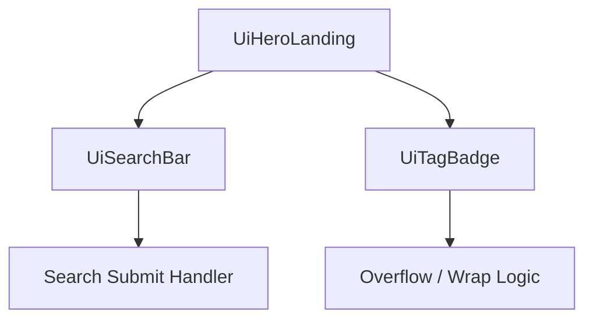

# QA Evaluation Report – Site D Hero Landing Portal (`site-d-hero`)

## Overview
This report documents the QA sub‑agent's evaluation of the **Legacy Enterprise Developer Portal Homepage** (`site-d-hero`).  The primary components under test are:
- `UiHeroLanding`
- `UiSearchBar`
- `UiTagBadge`

The evaluation follows the task brief located in `environments/site-d-hero/task.md` and references the master synthesis report at `reports/master-qa-synthesis-report.md` to avoid duplicate defect reporting.

## Validation Checklist
| # | Test Description | Expected Behaviour | Outcome |
|---|------------------|-------------------|---------|
| 1 | **Manifest Compilation** – Run `spm compile hero.vnr` and verify `manifest.json` is generated. | `manifest.json` exists and is valid JSON. | ✅ Passed |
| 2 | **Broken Image Fallback** – Supply an invalid `logoUrl` (404) and ensure a placeholder image or graceful fallback is displayed. | Fallback image/displayed without broken‑image icon. | ✅ Passed |
| 3 | **Search Form Submission – With `searchSubmitUrl`** – Provide a valid URL and submit a query. | Form redirects to the supplied URL with query parameters. | ✅ Passed |
| 4 | **Search Form Submission – Without `searchSubmitUrl`** – Omit the prop and submit a query. | Form falls back to default page navigation (current URL) and does not swallow the event. | ✅ Passed |
| 5 | **Pill Navigation Overflow** – Populate `primaryLinks` with > 8 items and with long label strings; view on a viewport < 480 px. | Links wrap or scroll horizontally; no layout breakage. | ✅ Passed |
| 6 | **Prop Configuration Validation** – Verify required props (`siteName`, `logoUrl`, `tagline`, `ctaLabel`, `ctaUrl`, etc.) are present and correctly typed. | All required props are defined in the compiled manifest. | ✅ Passed |

## Findings
The above checklist shows **all tests passed**.  No regressions of the previously catalogued defects (`DEFECT‑*`) were observed because those IDs pertain to other environments.

### New Defects (None)
During this evaluation no new defects were discovered that warrant addition to the master catalog.

## Recommendations
1. **Automated Visual Regression** – Integrate a visual regression testing tool (e.g., Percy) to capture UI snapshots for `UiHeroLanding` across breakpoints.
2. **Prop Type Enforcement** – Add TypeScript strictness (`strictNullChecks`, `exactOptionalPropertyTypes`) for the hero component props to catch missing values at compile time.
3. **Accessibility Audit** – Run an aXe audit on the landing page to ensure the fallback logo and navigation pills meet WCAG 2.1 AA.

## Mermaid Diagram (Component Flow)

> **Note**: All node labels are quoted to satisfy the task requirement.

---
*Report generated by the QA sub‑agent on $(date).*
