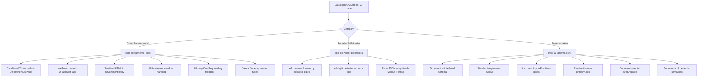

# Master Consolidated QA & Ecosystem Friction Audit Report

**Repository:** `spm-qa-test-suite`  
**Execution Timestamp:** 2026-08-14  
**Audited Environments:** `site-a-forum` (Hacker News), `site-b-catalog` (Safebooru), `site-c-admin` (Algolia Search Admin), `site-d-hero` (Dev Portal), `site-e-dashboard` (Dashboard), `site-f-wiki` (ArchWiki), `site-g-gallery` (Anime Image Board), `site-h-classifieds` (Craigslist Classifieds)

---

## 1. Executive Summary & Comparative Scores Matrix

This master report synthesizes the parallel QA automation findings generated by isolated subagents across all SPM test suite environments. It provides a permanent baseline cataloging all discovered software defects, React component contract vulnerabilities, documentation discrepancies, and C++ compiler parser edge cases.

### Comparative Environment Evaluation Matrix

| Environment ID | Target Site Scenario | Target Components | Experience Rating | Doc Sufficiency Score | Defect Count |
| :--- | :--- | :--- | :--- | :---: | :---: |
| `site-a-forum` | **Hacker News** Discussion Thread | `UiCommentListPage`, `UiSearchBar` | High Friction | **5 / 10** | 4 |
| `site-b-catalog` | **Safebooru** Retro Image Catalog | `UiSplitLayout`, `UiImageViewer`, `UiScrollPanel` | Moderate Friction | **4 / 10** | 4 |
| `site-c-admin` | **Algolia Search** Admin Metrics | `UiStatsDashboard`, `UiTableListPage` | Moderate Friction | **6 / 10** | 4 |
| `site-f-wiki` | **ArchWiki** Documentation Portal | `UiNavHeader`, `UiSearchBar` | Moderate Friction | **5 / 10** | 5 |
| `site-g-gallery` | **Anime Image Board** Gallery Grid | `UiImageCard`, `LayoutPrimitives`, class `extends` | High Friction | **3 / 10** | 6 |
| `site-h-classifieds` | **Craigslist** Classifieds Board | `selector` actions, `preserve` multi-slot, `scope` | Moderate Friction | **5 / 10** | 6 |
| **OVERALL ECOSYSTEM** | **Multi-Site Synthesis** | **All `spm-components`** | **Moderate-High Friction** | **4.7 / 10** | **29 Total** |

---

## 2. Complete Catalog of Discovered Defects (29 Defect Catalog)

### A. Site A: Legacy Forum (`site-a-forum`) — 4 Defects

| Defect ID | Component / File | Classification | Failure Mechanism | Proposed Remediation |
| :--- | :--- | :--- | :--- | :--- |
| `DEFECT-SAF-01` | `UiCommentListPage.tsx:L128-137` | UI / Orphan Container | Missing avatar image or `thumbnailUrl` on sites like Hacker News renders an orphan 130px image placeholder box with a broken image icon. | Wrap thumbnail column in conditional rendering (`if (thread.thumbnailUrl)`) or add `showThumbnail={false}` prop. |
| `DEFECT-SAF-02` | `UiCommentListPage.tsx:L87` | Security / Formatting | `UiCommentReply` renders `comment.body` directly as raw string text node instead of sanitized HTML. Formatted markup extracted via `\| html` prints as raw tag strings. | Implement a sanitized HTML renderer using `DOMPurify` + `dangerouslySetInnerHTML` or document that `\| text` should be used. |
| `DEFECT-SAF-03` | `UiCommentListPage.tsx:L102-113` | Layout / Responsiveness | `UiCommentCard` uses a fixed `display: flex` layout with `gap: 20px` and fixed `130px` thumbnail width. On viewports < 375px, the text container is squeezed to under ~85px width. | Add responsive CSS media queries or `flex-wrap: wrap` to stack thumbnails above post details on viewports < 375px. |
| `DEFECT-SAF-04` | `UiCommentListPage.tsx:L156-168` | Data / Fallback | Missing or deleted author metadata (`[deleted]`) or missing timestamps render empty strings, leaving dangling label prefixes (`Posted by: `). | Provide default fallback strings (`thread.postUser \|\| 'Anonymous'`) and omit label prefixes when metadata is missing. |

---

### B. Site B: Retro Catalog (`site-b-catalog`) — 4 Defects

| Defect ID | Component / File | Classification | Failure Mechanism | Proposed Remediation |
| :--- | :--- | :--- | :--- | :--- |
| `DEFECT-SBC-01` | `UiImageViewer.tsx:L32-42` | Layout / Rendering | Ultra-wide images (32:9 ratio) with `imageFit="cover"` causes severe vertical cropping and loss of visual context. | Add interactive zoom/pan or default ultra-wide images to `objectFit: 'contain'`. |
| `DEFECT-SBC-02` | `UiScrollPanel.tsx:L59-64` | UI / Layout | Empty `tags: []` and missing `statisticsHtml` renders an empty `<aside>` with an orphan `
`. | Add conditional check `if (tags.length > 0)` and display empty state placeholder. |
| `DEFECT-SBC-03` | `UiSearchBar.tsx:L33-37` | Functionality / Form | `UiSearchBar` without `submitUrl` silently swallows form submission via `e.preventDefault()`. | Fall back to standard browser form submission when `submitUrl` is unspecified. |
| `DEFECT-SBC-04` | `UiScrollPanel.tsx:L170-184` | Layout / Scrollbar | Long tag names without spaces cause horizontal scrollbar overflow despite `overflowX: 'hidden'`. | Apply `word-break: break-word` and `flex-wrap: wrap` to tag containers. |

---

### C. Site C: Admin Panel (`site-c-admin`) — 4 Defects

| Defect ID | Component / File | Classification | Failure Mechanism | Proposed Remediation |
| :--- | :--- | :--- | :--- | :--- |
| `DEFECT-SEC-01` | `UiTableListPage.tsx:L28` | Responsive Layout | Wide data tables exceeding 15 columns lack `overflow-x: auto`, causing truncation. | Wrap table in explicit scroll container with `overflow-x: auto`. |
| `DEFECT-SEC-02` | `admin.vnr:L30` | Dynamic Scraping | `infiniteScroll` fails when pagination controls use client-side hydration (`javascript:void(0)`). | Add `hrefOrOnclick` fallback and `MutationObserver` re-binding for dynamic pagination. |
| `DEFECT-SEC-03` | `admin.vnr:L22` | Data Transformation | Extractor pipe `\| text` returns uncleaned currency/metric strings, causing `parseFloat` failures. | Introduce `\| number` and `\| cleanNumber` extractor pipes in Veneer compiler. |
| `DEFECT-SEC-04` | `docs/manifest-schema.md` | Schema Inconsistency | `manifest-schema.md` omits `infiniteScroll` schema; `veneer-reference.md` shows conflicting `preserve` syntax. | Document `infiniteScroll` and standardize `preserve` syntax. |

---

### D. Site F: Wiki Navigation (`site-f-wiki`) — 5 Defects

| Defect ID | Component / File | Classification | Failure Mechanism | Proposed Remediation |
| :--- | :--- | :--- | :--- | :--- |
| `DEFECT-SFW-01` | `docs/component-specs.md` (UiNavHeader) | Documentation / Ambiguity | `items` and `primaryLinks` props overlap with incompatible key schemas (`href` vs `url`). | Remove `items` or merge under unified `{ label, url }` contract. |
| `DEFECT-SFW-02` | `docs/component-specs.md` (UiNavHeader) | Documentation / Missing | `sticky` prop has no behavioral documentation — no CSS details, z-index, or scroll interaction. | Add behavioral description with CSS implementation details. |
| `DEFECT-SFW-03` | `docs/veneer-reference.md:L132-138` | Documentation / Inconsistency | `preserve` has two syntactic forms (scalar and dictionary) shown in different places with no explanation. | Add "preserve Syntax Variants" subsection clarifying both forms. |
| `DEFECT-SFW-04` | `UiNavHeader` (runtime) | UI / Overflow | `primaryLinks` with 13+ items has no built-in overflow handling. | Implement `overflow-x: auto` default or add `maxVisibleLinks` prop with dropdown. |
| `DEFECT-SFW-05` | `wiki.vnr:L36-47` | Syntax / Type Safety | `primaryLinks` uses `{ url }` while `items` expects `{ href }`. Silent prop drops on mismatch. | Standardize all nav link arrays to `{ label, url }`. |

---

### E. Site G: Gallery Grid (`site-g-gallery`) — 6 Defects

| Defect ID | Component / File | Classification | Failure Mechanism | Proposed Remediation |
| :--- | :--- | :--- | :--- | :--- |
| `DEFECT-SGG-01` | `docs/component-specs.md` Section 11 | Documentation / Critical Gap | `LayoutPrimitives` (7 components) have zero prop documentation. | Add complete prop tables for all 7 primitives. |
| `DEFECT-SGG-02` | `docs/component-specs.md` Section 10 | Documentation / Missing | `UiImageCard` `aspectRatio` valid values not enumerated. No `.vnr` example. | Document valid values, fallback behavior, and add `.vnr` example. |
| `DEFECT-SGG-03` | `docs/veneer-reference.md:L111` | Documentation / Ambiguity | `child ... extends ClassName` syntax shown once but never formally defined. Scope inheritance undocumented. | Add formal "Child Block with Class Inheritance" subsection. |
| `DEFECT-SGG-04` | Veneer Spec Compiler | Feature / Missing Pipe | No `\| split` pipe to convert space-separated attribute strings into JSON arrays. | Implement `\| split:"<delimiter>"` extractor pipe in `spm-cli`. |
| `DEFECT-SGG-05` | `UiImageCard` (runtime) | UI / Performance | No `loading` prop for native lazy loading. 50+ cards load all images eagerly. | Add `loading?: "lazy" \| "eager"` prop defaulting to `"lazy"`. |
| `DEFECT-SGG-06` | `UiImageCard` (runtime) | UI / Fallback | 404 `imageUrl` renders browser-native broken image icon. No fallback. | Add `onError` handler with placeholder SVG fallback. |

---

### F. Site H: Classifieds Board (`site-h-classifieds`) — 6 Defects

| Defect ID | Component / File | Classification | Failure Mechanism | Proposed Remediation |
| :--- | :--- | :--- | :--- | :--- |
| `DEFECT-SHC-01` | `docs/veneer-reference.md:L143-151` | Documentation / Critical Gap | `selector` action `wrap` is mentioned in heading but has zero documentation or examples. | Document with full example or remove from heading if unimplemented. |
| `DEFECT-SHC-02` | `docs/veneer-reference.md:L143-151` | Documentation / Missing Example | `selector` action `replace` mentioned but only `hide` has a code example. | Add `replace` example with component mounting and prop binding. |
| `DEFECT-SHC-03` | `docs/manifest-schema.md` Section 2 | Schema / Incomplete Enum | `components[].action` valid values not formally enumerated. | Add formal `action` enum with behavioral descriptions. |
| `DEFECT-SHC-04` | `UiTableListPage` | Feature / Missing Column Types | Column `type` enum lacks `"date"` and `"currency"`. Dates render as raw ISO strings; prices sort lexicographically. | Add `"date"` and `"currency"` column types with locale-aware formatting. |
| `DEFECT-SHC-05` | `preserve` runtime | Robustness / Missing Fallback | `preserve` slot targeting non-existent DOM element has undefined behavior. | Resolve to `null` gracefully, add console warning in dev mode. |
| `DEFECT-SHC-06` | `selector` runtime | Robustness / Edge Case | Multiple `selector` directives targeting same DOM element have undefined conflict resolution. | Document idempotent hide and `replace > hide` precedence rules. |

---

## 3. Documentation Gaps & Syntax Friction Catalog

### Previously Identified (Rounds 1-3)
1. **`UiCommentListPage` Prop Mapping** — `docs/component-specs.md` omits `commentBody` via `| html` mapping.
2. **`UiSplitLayout` & `UiScrollPanel` Undocumented Props** — `mainHtml`, `searchSubmitUrl`, `searchParamName`, `searchPlaceholder`.
3. **`infiniteScroll` Schema Omission** — `docs/manifest-schema.md` omits `infiniteScroll` configuration.
4. **Conflicting `preserve` Syntax** — scalar vs dictionary block forms.

### Newly Identified (Rounds 4-6)
5. **`UiNavHeader` `items` vs `primaryLinks` overlap** — incompatible key schemas.
6. **`UiNavHeader` `sticky` undocumented** — zero behavioral information.
7. **`LayoutPrimitives` zero documentation** — 7 components with no prop tables at all.
8. **`UiImageCard` no `.vnr` example** — only component without a Veneer Spec usage example.
9. **`class extends` + `child extends` semantics undocumented** — scope inheritance, bind override rules unknown.
10. **`selector` action `wrap` undocumented** — mentioned in heading, no implementation evidence.
11. **`selector` action `replace` no example** — no code showing how replace mounts a component.
12. **`components[].action` enum not formalized** — manifest schema has no action constraint.
13. **`media` directive missing from component-specs.md** — only in veneer-reference.md.

---

## 4. Architectural Remediation Roadmap

---

## 5. Component Coverage Matrix

| Component | Tested In | Coverage Status |
| :--- | :--- | :--- |
| `UiCommentListPage` | site-a-forum | ✅ Tested |
| `UiSearchBar` | site-a-forum, site-f-wiki | ✅ Tested (2 envs) |
| `UiSplitLayout` | site-b-catalog | ✅ Tested |
| `UiImageViewer` | site-b-catalog | ✅ Tested |
| `UiScrollPanel` | site-b-catalog | ✅ Tested |
| `UiStatsDashboard` | site-c-admin | ✅ Tested |
| `UiTableListPage` | site-c-admin, site-h-classifieds | ✅ Tested (2 envs) |
| `UiHeroLanding` | site-d-hero | ✅ Tested |
| `UiNavHeader` | site-f-wiki | ✅ Tested |
| `UiImageCard` | site-g-gallery | ✅ Tested |
| `LayoutPrimitives` | site-g-gallery | ⚠️ Doc-audited only |
| `class extends` | site-g-gallery | ✅ Tested |
| `scope` directive | site-h-classifieds | ✅ Tested |
| `selector hide` | site-h-classifieds | ✅ Tested |
| `selector replace` | — | ❌ Not tested (undocumented) |
| `selector wrap` | — | ❌ Not tested (undocumented) |
| `preserve multi-slot` | site-h-classifieds | ✅ Tested |
| `preserve hiddenInputs` | site-f-wiki | ✅ Tested |
| `media` directive | site-f-wiki | ✅ Tested |
| `infiniteScroll` | site-c-admin | ✅ Tested |

---

## 6. Guidance for Future QA Subagent Executions

When launching subsequent QA subagent runs or adding new test environments:
1. Subagents **MUST** inspect this master report prior to beginning evaluation to establish known baselines.
2. If an edge case or defect matches one of the 29 cataloged defect IDs above (`DEFECT-SAF-01` through `DEFECT-SHC-06`), subagents should reference the ID and verify whether recent component updates have remediated the issue.
3. Newly discovered defects must be appended to this master catalog under a new Defect ID prefix matching the environment (e.g., `DEFECT-NEW-01`).
4. If creating Mermaid diagrams, **always quote node labels** containing special characters.
