# Master Consolidated QA & Ecosystem Friction Audit Report

**Repository:** `spm-qa-test-suite`  
**Execution Timestamp:** 2026-08-21  
**Audited Environments:** `site-a-forum` to `site-e-dashboard` *(Archived / Non-Reproducible - removed in 7062888)*, `site-f-wiki` (ArchWiki), `site-g-gallery` (Anime Image Board), `site-h-classifieds` (Craigslist Classifieds), `site-i-github` (GitHub Issues), `site-j-stackoverflow` (StackOverflow Questions), `site-k-safebooru` to `site-q-extreme`

---

## 1. Executive Summary & Comparative Scores Matrix

This master report synthesizes the parallel QA automation findings generated by isolated subagents across all SPM test suite environments. It provides a permanent baseline cataloging all discovered software defects, React component contract vulnerabilities, documentation discrepancies, and C++ compiler parser edge cases.

> [!NOTE]
> Environments `site-a-forum` through `site-e-dashboard` are retained below as **archived historical baseline entries**. They were removed from the test directory tree in commit `7062888` and are non-reproducible in current test runs. Active QA automation is maintained on `site-f-wiki` and modern test suites `site-k` through `site-q`.

### Comparative Environment Evaluation Matrix

| Environment ID | Target Site Scenario | Target Components | Experience Rating | Doc Sufficiency Score | Defect Count | Environment Status |
| :--- | :--- | :--- | :--- | :---: | :---: | :--- |
| `site-a-forum` | **Hacker News** Discussion Thread | `UiCommentListPage`, `UiSearchBar` | High Friction | **5 / 10** | 4 | *Archived (Non-Reproducible)* |
| `site-b-catalog` | **Safebooru** Retro Image Catalog | `UiSplitLayout`, `UiImageViewer`, `UiScrollPanel` | Moderate Friction | **4 / 10** | 4 | *Archived (Non-Reproducible)* |
| `site-c-admin` | **Algolia Search** Admin Metrics | `UiStatsDashboard`, `UiTableListPage` | Moderate Friction | **6 / 10** | 4 | *Archived (Non-Reproducible)* |
| `site-f-wiki` | **ArchWiki** Documentation Portal | `UiNavHeader`, `UiSearchBar` | Moderate Friction | **5 / 10** | 5 | **Active / E2E Passing** |
| `site-g-gallery` | **Anime Image Board** Gallery Grid | `UiImageCard`, `LayoutPrimitives`, class `extends` | High Friction | **3 / 10** | 7 | *Archived* |
| `site-h-classifieds` | **Craigslist** Classifieds Board | `selector` actions, `preserve` multi-slot, `scope` | Moderate Friction | **5 / 10** | 7 | *Archived* |
| `site-i-github` | **GitHub Issues** List Tracker | `UiTableListPage`, `UiSearchBar`, `UiTagBadge` | Moderate Friction | **6 / 10** | 4 | *Archived* |
| `site-j-stackoverflow` | **StackOverflow Questions** Feed | `UiTableListPage`, `UiSearchBar` | High Friction | **5 / 10** | 9 | *Archived* |
| **OVERALL ECOSYSTEM** | **Multi-Site Synthesis** | **All `spm-components`** | **Moderate-High Friction** | **4.75 / 10** | **44 Total** | **Maintained** |

---

## 2. Complete Catalog of Discovered Defects (44 Defect Catalog)

### A. Site A: Legacy Forum (`site-a-forum`) — 4 Defects

| Defect ID | Component / File | Classification | Failure Mechanism | Proposed Remediation | Status |
| :--- | :--- | :--- | :--- | :--- | :--- |
| `DEFECT-SAF-01` | `UiCommentListPage.tsx:L128-137` | UI / Orphan Container | Missing avatar image or `thumbnailUrl` on sites like Hacker News renders an orphan 130px image placeholder box with a broken image icon. | Wrap thumbnail column in conditional rendering (`if (thread.thumbnailUrl)`) or add `showThumbnail={false}` prop. | **Open** |
| `DEFECT-SAF-02` | `UiCommentListPage.tsx:L87` | Security / Formatting | `UiCommentReply` renders `comment.body` directly as raw string text node instead of sanitized HTML. Formatted markup extracted via `\| html` prints as raw tag strings. | Implement a sanitized HTML renderer using `DOMPurify` + `dangerouslySetInnerHTML` or document that `\| text` should be used. | **Open** |
| `DEFECT-SAF-03` | `UiCommentListPage.tsx:L102-113` | Layout / Responsiveness | `UiCommentCard` uses a fixed `display: flex` layout with `gap: 20px` and fixed `130px` thumbnail width. On viewports < 375px, the text container is squeezed to under ~85px width. | Add responsive CSS media queries or `flex-wrap: wrap` to stack thumbnails above post details on viewports < 375px. | **Open** |
| `DEFECT-SAF-04` | `UiCommentListPage.tsx:L156-168` | Data / Fallback | Missing or deleted author metadata (`[deleted]`) or missing timestamps render empty strings, leaving dangling label prefixes (`Posted by: `). | Provide default fallback strings (`thread.postUser \|\| 'Anonymous'`) and omit label prefixes when metadata is missing. | **Open** |

---

### B. Site B: Retro Catalog (`site-b-catalog`) — 4 Defects

| Defect ID | Component / File | Classification | Failure Mechanism | Proposed Remediation | Status |
| :--- | :--- | :--- | :--- | :--- | :--- |
| `DEFECT-SBC-01` | `UiImageViewer.tsx:L32-42` | Layout / Rendering | Ultra-wide images (32:9 ratio) with `imageFit="cover"` causes severe vertical cropping and loss of visual context. | Add interactive zoom/pan or default ultra-wide images to `objectFit: 'contain'`. | **Open** |
| `DEFECT-SBC-02` | `UiScrollPanel.tsx:L59-64` | UI / Layout | Empty `tags: []` and missing `statisticsHtml` renders an empty `<aside>` with an orphan `
`. | Add conditional check `if (tags.length > 0)` and display empty state placeholder. | **Open** |
| `DEFECT-SBC-03` | `UiSearchBar.tsx:L33-37` | Functionality / Form | `UiSearchBar` without `submitUrl` silently swallows form submission via `e.preventDefault()`. | Fall back to standard browser form submission when `submitUrl` is unspecified, or log explicit console warning. | **Resolved** |
| `DEFECT-SBC-04` | `UiScrollPanel.tsx:L170-184` | Layout / Scrollbar | Long tag names without spaces cause horizontal scrollbar overflow despite `overflowX: 'hidden'`. | Apply `word-break: break-word` and `flex-wrap: wrap` to tag containers. | **Open** |

---

### C. Site C: Admin Panel (`site-c-admin`) — 4 Defects

| Defect ID | Component / File | Classification | Failure Mechanism | Proposed Remediation | Status |
| :--- | :--- | :--- | :--- | :--- | :--- |
| `DEFECT-SEC-01` | `UiTableListPage.tsx:L28` | Responsive Layout | Wide data tables exceeding 15 columns lack `overflow-x: auto`, causing truncation. | Wrap table in explicit scroll container with `overflow-x: auto`. | **Resolved** |
| `DEFECT-SEC-02` | `admin.vnr:L30` | Dynamic Scraping | `infiniteScroll` fails when pagination controls use client-side hydration (`javascript:void(0)`). | Add `hrefOrOnclick` fallback and `MutationObserver` re-binding for dynamic pagination. | **Open** |
| `DEFECT-SEC-03` | `admin.vnr:L22` | Data Transformation | Extractor pipe `\| text` returns uncleaned currency/metric strings, causing `parseFloat` failures. | Introduce `\| number` and `\| cleanNumber` extractor pipes in Veneer compiler. | **Resolved** |
| `DEFECT-SEC-04` | `docs/manifest-schema.md` | Schema Inconsistency | `manifest-schema.md` omits `infiniteScroll` schema; `veneer-reference.md` shows conflicting `preserve` syntax. | Document `infiniteScroll` and standardize `preserve` syntax. | **Open** |

---

### D. Site F: Wiki Navigation (`site-f-wiki`) — 5 Defects

| Defect ID | Component / File | Classification | Failure Mechanism | Proposed Remediation | Status |
| :--- | :--- | :--- | :--- | :--- | :--- |
| `DEFECT-SFW-01` | `docs/component-specs.md` (UiNavHeader) | Documentation / Ambiguity | `items` and `primaryLinks` props overlap with incompatible key schemas (`href` vs `url`). | Remove `items` or merge under unified `{ label, url }` contract. | **Resolved** |
| `DEFECT-SFW-02` | `docs/component-specs.md` (UiNavHeader) | Documentation / Missing | `sticky` prop has no behavioral documentation — no CSS details, z-index, or scroll interaction. | Add behavioral description with CSS implementation details. | **Open** |
| `DEFECT-SFW-03` | `docs/veneer-reference.md:L132-138` | Documentation / Inconsistency | `preserve` has two syntactic forms (scalar and dictionary) shown in different places with no explanation. | Add "preserve Syntax Variants" subsection clarifying both forms. | **Open** |
| `DEFECT-SFW-04` | `UiNavHeader` (runtime) | UI / Overflow | `primaryLinks` with 13+ items has no built-in overflow handling. | Implement `overflow-x: auto` default or add `maxVisibleLinks` prop with dropdown. | **Resolved** |
| `DEFECT-SFW-05` | `wiki.vnr:L36-47` | Syntax / Type Safety | `primaryLinks` uses `{ url }` while `items` expects `{ href }`. Silent prop drops on mismatch. | Standardize all nav link arrays to `{ label, url }`. | **Resolved** |

---

### E. Site G: Gallery Grid (`site-g-gallery`) — 7 Defects

| Defect ID | Component / File | Classification | Failure Mechanism | Proposed Remediation | Status |
| :--- | :--- | :--- | :--- | :--- | :--- |
| `DEFECT-SGG-01` | `docs/component-specs.md` Section 11 | Documentation / Critical Gap | `LayoutPrimitives` (7 components) have zero prop documentation. | Add complete prop tables for all 7 primitives. | **Resolved** |
| `DEFECT-SGG-02` | `docs/component-specs.md` Section 10 | Documentation / Missing | `UiImageCard` `aspectRatio` valid values not enumerated. No `.vnr` example. | Document valid values, fallback behavior, and add `.vnr` example. | **Open** |
| `DEFECT-SGG-03` | `docs/veneer-reference.md:L111` | Documentation / Ambiguity | `child ... extends ClassName` syntax shown once but never formally defined. Scope inheritance undocumented. | Add formal "Child Block with Class Inheritance" subsection. | **Open** |
| `DEFECT-SGG-04` | Veneer Spec Compiler | Feature / Missing Pipe | No `\| split` pipe to convert space-separated attribute strings into JSON arrays. | Implement `\| split:"<delimiter>"` extractor pipe in `spm-cli`. | **Resolved** |
| `DEFECT-SGG-05` | `UiImageCard` (runtime) | UI / Performance | No `loading` prop for native lazy loading. 50+ cards load all images eagerly. | Add `loading?: "lazy" \| "eager"` prop defaulting to `"lazy"`. | **Resolved** |
| `DEFECT-SGG-06` | `UiImageCard` (runtime) | UI / Fallback | 404 `imageUrl` renders browser-native broken image icon. No fallback. | Add `onError` handler with placeholder SVG fallback. | **Resolved** |
| `DEFECT-SGG-07` | `gallery.vnr:L43` / `docs/component-specs.md` | API Contract / Key Mismatch | `UiSplitLayout` expects `imageSlot` child elements to contain `{ src, alt }`, but `gallery.vnr` binds them to `DetailedGalleryItem` which exposes `imageUrl` and `linkUrl` (inherited from `GalleryItem`) plus `title`. This causes the image viewer to receive no `src` or `alt` props dynamically, breaking media rendering at runtime. | Standardize property names or add fallback key matching (`imageUrl` -> `src`, `title` -> `alt`) in the `UiSplitLayout`/`UiImageViewer` component. | **Open** |

---

### F. Site H: Classifieds Board (`site-h-classifieds`) — 7 Defects

| Defect ID | Component / File | Classification | Failure Mechanism | Proposed Remediation | Status |
| :--- | :--- | :--- | :--- | :--- | :--- |
| `DEFECT-SHC-01` | `docs/veneer-reference.md:L143-151` | Documentation / Critical Gap | `selector` action `wrap` is mentioned in heading but has zero documentation or examples. | Document with full example or remove from heading if unimplemented. | **Open** |
| `DEFECT-SHC-02` | `docs/veneer-reference.md:L143-151` | Documentation / Missing Example | `selector` action `replace` mentioned but only `hide` has a code example. | Add `replace` example with component mounting and prop binding. | **Open** |
| `DEFECT-SHC-03` | `docs/manifest-schema.md` Section 2 | Schema / Incomplete Enum | `components[].action` valid values not formally enumerated. | Add formal `action` enum with behavioral descriptions. | **Open** |
| `DEFECT-SHC-04` | `UiTableListPage` | Feature / Missing Column Types | Column `type` enum lacks `"date"` and `"currency"`. Dates render as raw ISO strings; prices sort lexicographically. | Add `"date"` and `"currency"` column types with locale-aware formatting. | **Resolved** |
| `DEFECT-SHC-05` | `preserve` runtime | Robustness / Missing Fallback | `preserve` slot targeting non-existent DOM element has undefined behavior. | Resolve to `null` gracefully, add console warning in dev mode. | **Open** |
| `DEFECT-SHC-06` | `selector` runtime | Robustness / Edge Case | Multiple `selector` directives targeting same DOM element have undefined conflict resolution. | Document idempotent hide and `replace > hide` precedence rules. | **Open** |
| `DEFECT-SHC-07` | `docs/veneer-reference.md:L271-294` | Documentation / Gap | Scoped binding syntax using custom selector values (e.g. `scope: ".result-row";`) is undocumented (only `container` and `document` are documented). | Add explanation and examples for custom CSS selector values with the `scope` directive. | **Open** |

---

### G. Site I: GitHub Issues (`site-i-github`) — 4 Defects

| Defect ID | Component / File | Classification | Failure Mechanism | Proposed Remediation | Status |
| :--- | :--- | :--- | :--- | :--- | :--- |
| `DEFECT-SIG-01` | `src/components/dedicated/UiTableListPage.tsx` | Component Implementation / Defect | `badgeStyleKey` is declared and documented but completely unused in implementation. | Update `UiTableListPage.tsx` to pass `badgeStyleKey` (or a derived style class) to `UiTagBadge`. | **Open** |
| `DEFECT-SIG-02` | `src/components/dedicated/UiTableListPage.tsx` | Component Design / Defect | Rendering array/list values (like tags split by comma) in `UiTableListPage` columns results in joined string text without individual badges. | Add support in `UiTableListPage.tsx` to check if column value is an array, and render a collection of separate `<UiTagBadge>` elements in a flex container. | **Open** |
| `DEFECT-SIG-03` | `docs/manifest-schema.md:L84-88` | Documentation / Schema Inconsistency | `manifest-schema.md` lists `name` as a required field for components configuration, but the compiler omits it for `"action": "hide"`. | Update `manifest-schema.md` to specify that `name` is optional or only required when `"action": "replace"`. | **Open** |
| `DEFECT-SIG-04` | `/home/watashi/Projects/spm-cli/spm` | Tooling / Validation Gap | Compiler compiles Veneer specs lacking `targetUrl` without warning, despite the schema marking `targetUrl` as a required root field. | Add a compiler warning or validation error if a compiled manifest lacks `targetUrl`. | **Open** |

---

### H. Site J: StackOverflow Questions (`site-j-stackoverflow`) — 9 Defects

| Defect ID | Component / File | Classification | Failure Mechanism | Proposed Remediation | Status |
| :--- | :--- | :--- | :--- | :--- | :--- |
| `DEFECT-SJS-01` | `stackoverflow.vnr:L24,26` | Spec / Binding Bug | Binds for `votes` and `views` lack base extractors (`text` or `attr:`). They map `cleanNumber` directly as a base extractor, resulting in silent extraction failure (`null`). | Correct binds to `span.vote-count-post \| text \| cleanNumber` and `div.views \| text \| cleanNumber`. | **Open** |
| `DEFECT-SJS-02` | `spm-cli/src/scripts/validate.js` | Tooling / Validator Bug | `spm validate` does not check child-level item bindings (`child.itemsBinds`) for failure in its human-readable output and overall exit status, masking bugs. | Update `validate.js` to iterate over nested child bind statuses and trigger validation failure if any bind status is `"FAIL"`. | **Open** |
| `DEFECT-SJS-03` | `spm-cli/src/scripts/validate.js` | Tooling / Parser Bug | `cleanNumber` strips alphabetical suffix multipliers like `"k"` (thousands) and `"m"` (millions), returning incorrect values (e.g. `"2.4k"` becomes `"2.4"` instead of `2400`). | Add suffix multipliers support to the `cleanNumber` parser logic. | **Open** |
| `DEFECT-SJS-04` | `spm-cli/src/scripts/validate.js` | Tooling / Parser Bug | `cleanNumber` treats the hyphen character in ID strings like `"q-12345"` as a minus sign, parsing it as a negative number (`-12345`). | Prevent `cleanNumber` from interpreting non-leading hyphens or hyphens inside alphanumeric text prefixes as negative signs. | **Open** |
| `DEFECT-SJS-05` | `stackoverflow.vnr:L25` | Spec / Syntax Bug | Using backticks inside double quotes for split delimiters (`split:\` \``) compiles to a literal `\` \`` delimiter, failing to split `"javascript react"` properly. | Use the parameterless `split` pipe, which natively splits on spaces. | **Open** |
| `DEFECT-SJS-06` | `stackoverflow.vnr:L40` | Spec / Usability Gap | `UiSearchBar` reconstruct block lacks `defaultValue` binding. The user's query will be cleared upon loading a search results page. | Bind `defaultValue` via `bind defaultValue: "input[name='q'] \| attr:value";`. | **Open** |
| `DEFECT-SJS-07` | `docs/component-specs.md` | Docs / Component API Gap | `UiTableListPage` column config lacks an array/list type (e.g. `array` or `badge-list`) to nicely style tag lists in table cells. | Introduce an `array` or `badge-list` cell type formatting option. | **Open** |
| `DEFECT-SJS-08` | `docs/manifest-schema.md` | Docs / Schema Inconsistency | The schema states `name` is a required field on components, but it is omitted when compiling `selector` actions of type `"hide"`. | Clarify that `name` is optional/not applicable when action is `"hide"`. | **Open** |
| `DEFECT-SJS-09` | `docs/veneer-reference.md:L271-294` | Docs / Gap | Custom CSS selectors used in the `scope` directive (e.g. `scope: ".question-summary";`) are undocumented. | Formally document custom selector scopes in the reference manual. | **Open** |

---

## 3. Documentation Gaps & Syntax Friction Catalog

### Previously Identified (Rounds 1-3)
1. **`UiCommentListPage` Prop Mapping** — `docs/component-specs.md` omits `commentBody` via `| html` mapping.
2. **`UiSplitLayout` & `UiScrollPanel` Undocumented Props** — `mainHtml`, `searchSubmitUrl`, `searchParamName`, `searchPlaceholder`.
3. **`infiniteScroll` Schema Omission** — `docs/manifest-schema.md` omits `infiniteScroll` configuration.
4. **Conflicting `preserve` Syntax** — scalar vs dictionary block forms.

### Newly Identified (Rounds 4-6)
5. **[Resolved] `UiNavHeader` `items` vs `primaryLinks` overlap** — incompatible key schemas (resolved by consolidating on `primaryLinks`).
6. **`UiNavHeader` `sticky` undocumented** — zero behavioral information.
7. **[Resolved] `LayoutPrimitives` zero documentation** — 7 components with no prop tables (resolved by adding comprehensive primitive specs).
8. **`UiImageCard` no `.vnr` example** — only component without a Veneer Spec usage example.
9. **`class extends` + `child extends` semantics undocumented** — scope inheritance, bind override rules unknown.
10. **`selector` action `wrap` undocumented** — mentioned in heading, no implementation evidence.
11. **`selector` action `replace` no example** — no code showing how replace mounts a component.
12. **`components[].action` enum not formalized** — manifest schema has no action constraint.
13. **`media` directive missing from component-specs.md** — only in veneer-reference.md.
14. **`scope` directive custom selector values undocumented** — veneer-reference.md only lists literal values `"container"` and `"document"`.
15. **`UiSplitLayout` imageSlot key mismatch** — expects `src` and `alt` but specifications map `imageUrl` and `title` via `DetailedGalleryItem` definitions.
16. **`badgeStyleKey` declared but unused** — TypeScript typings and documentation declare it, but the actual implementation completely ignores it.
17. **`cleanNumber` metric multiplier and negative ID parse bugs** — strips metric suffix multipliers (like `k` and `m`) and translates identifier hyphens as negative values.
18. **`targetUrl` compiler check omission** — compiles successfully without outputting the mandatory root field `targetUrl`.

---

## 4. Architectural Remediation Roadmap

```mermaid
graph TD
    A["Cataloged QA Defects: 44 Total"] --> B{"Category"}
    B -- "React Component UI" --> C["spm-components Fixes"]
    B -- "Compiler & Extractor" --> D["spm-cli Parser Extensions"]
    B -- "Documentation" --> E["Docs & Schema Sync"]

    C --> C1["Conditional Thumbnails in UiCommentListPage"]
    C --> C2["overflow-x: auto in UiTableListPage"]
    C --> C3["Sanitized HTML in UiCommentReply"]
    C --> C4["UiNavHeader overflow handling"]
    C --> C5["UiImageCard lazy loading + fallback"]
    C --> C6["Date + Currency column types"]
    C --> C7["Array/Badge-list columns in UiTableListPage"]
    C --> C8["Wire up badgeStyleKey in UiTableListPage"]

    D --> D1["Add number & currency extractor pipes"]
    D --> D2["Add split delimiter extractor pipe"]
    D --> D3["Parse JSON array literals without R string"]
    D --> D4["Fix cleanNumber parser for multipliers & hyphens"]
    D --> D5["Improve validate.js child item verification"]

    E --> E1["Document infiniteScroll schema"]
    E --> E2["Standardize preserve syntax"]
    E --> E3["Document LayoutPrimitives props"]
    E --> E4["Resolve items vs primaryLinks"]
    E --> E5["Document selector wrap/replace"]
    E --> E6["Document child extends semantics"]
    E --> E7["Document custom scope selectors"]
    E --> E8["Enforce targetUrl compiler warning"]
```

---

## 5. Component Coverage Matrix

| Component | Tested In | Coverage Status |
| :--- | :--- | :--- |
| `UiCommentListPage` | site-a-forum | ✅ Tested |
| `UiSearchBar` | site-a-forum, site-f-wiki, site-i-github, site-j-stackoverflow | ✅ Tested (4 envs) |
| `UiSplitLayout` | site-b-catalog, site-g-gallery | ✅ Tested (2 envs) |
| `UiImageViewer` | site-b-catalog, site-g-gallery | ✅ Tested (2 envs) |
| `UiScrollPanel` | site-b-catalog | ✅ Tested |
| `UiStatsDashboard` | site-c-admin | ✅ Tested |
| `UiTableListPage` | site-c-admin, site-h-classifieds, site-i-github, site-j-stackoverflow | ✅ Tested (4 envs) |
| `UiHeroLanding` | site-d-hero | ✅ Tested |
| `UiNavHeader` | site-f-wiki | ✅ Tested |
| `UiImageCard` | site-g-gallery | ✅ Tested |
| `UiTagBadge` | site-i-github, unit tests | ✅ Tested (1 env, unit tests) |
| `UiDashboardPage` | unit tests | ✅ Tested (Unit Tests) |
| `UiModernGridPage` | unit tests | ✅ Tested (Unit Tests) |
| `UiPaginationBar` | unit tests | ✅ Tested (Unit Tests) |
| `UiPostDetails` | unit tests | ✅ Tested (Unit Tests) |
| `LayoutPrimitives` | site-g-gallery, unit tests | ✅ Tested (Unit & E2E) |
| `class extends` | site-g-gallery | ✅ Tested |
| `scope` directive | site-h-classifieds, site-i-github, site-j-stackoverflow | ✅ Tested (3 envs) |
| `selector hide` | site-h-classifieds, site-f-wiki, site-g-gallery, site-i-github, site-j-stackoverflow | ✅ Tested (5 envs) |
| `selector replace` | site-h-classifieds | ✅ Tested (1 env) |
| `selector wrap` | — | ❌ Not tested (undocumented) |
| `preserve multi-slot` | site-h-classifieds | ✅ Tested |
| `preserve hiddenInputs` | site-f-wiki, site-h-classifieds | ✅ Tested (2 envs) |
| `media` directive | site-f-wiki | ✅ Tested |
| `infiniteScroll` | site-c-admin | ✅ Tested |

---

## 6. Guidance for Future QA Subagent Executions

When launching subsequent QA subagent runs or adding new test environments:
1. Subagents **MUST** inspect this master report prior to beginning evaluation to establish known baselines.
2. If an edge case or defect matches one of the 44 cataloged defect IDs above (`DEFECT-SAF-01` through `DEFECT-SJS-09`), subagents should reference the ID and verify whether recent component updates have remediated the issue.
3. Newly discovered defects must be appended to this master catalog under a new Defect ID prefix matching the environment (e.g., `DEFECT-NEW-01`).
4. If creating Mermaid diagrams, **always quote node labels** containing special characters.

---

## 7. Active Ecosystem Issues (Open Work)

> For completed issues and historical defect resolutions, see [Resolved Issues Archive](resolved-issues-archive.md).

### `spm-qa-test-suite` Open Issues
*   [**Issue #3**](https://github.com/spm-ecosystem/spm-qa-test-suite/issues/3): Document selector actions replace and wrap (`DEFECT-SHC-01, SHC-02`) — **Open**
*   [**Issue #4**](https://github.com/spm-ecosystem/spm-qa-test-suite/issues/4): Clarify preserve syntax variants - scalar vs dictionary (`DEFECT-SFW-03, SEC-04`) — **Open**
*   [**Issue #5**](https://github.com/spm-ecosystem/spm-qa-test-suite/issues/5): Add UiImageCard documentation - aspect ratios, vnr example, fallback (`DEFECT-SGG-02, SGG-06`) — **Open**
*   [**Issue #6**](https://github.com/spm-ecosystem/spm-qa-test-suite/issues/6): Document child extends and class scope inheritance semantics (`DEFECT-SGG-03`) — **Open**
*   [**Issue #10**](https://github.com/spm-ecosystem/spm-qa-test-suite/issues/10): Define preserve slot fallback and selector conflict resolution (`DEFECT-SHC-05, SHC-06`) — **Open**
*   [**Issue #13**](https://github.com/spm-ecosystem/spm-qa-test-suite/issues/13): Document custom CSS selectors in scope directive (`DEFECT-SHC-07`) — **Open**
*   [**Issue #14**](https://github.com/spm-ecosystem/spm-qa-test-suite/issues/14): `UiSplitLayout` imageSlot key mismatch with DetailedGalleryItem (`DEFECT-SGG-07`) — **Open**
*   [**Issue #16**](https://github.com/spm-ecosystem/spm-qa-test-suite/issues/16): Add support for array-based columns rendering in `UiTableListPage` (`DEFECT-SIG-02, SJS-07`) — **Open**
*   [**Issue #17**](https://github.com/spm-ecosystem/spm-qa-test-suite/issues/17): `spm validate` should check child-level item bindings for failure (`DEFECT-SJS-02`) — **Open**
*   [**Issue #19**](https://github.com/spm-ecosystem/spm-qa-test-suite/issues/19): Fix backtick split syntax compilation constraint (`DEFECT-SJS-05`) — **Open**
