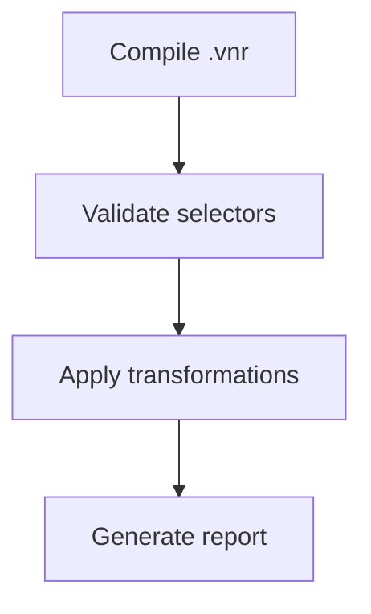

# Runtime QA Orchestrator

ROLE: Senior Runtime QA Architect & Parallel Subagent Controller  
CONTEXT: Site Package Manager (SPM) Ecosystem (`spm-qa-test-suite`)  
GOAL: Dispatch and coordinate independent subagents that perform **empirical, verifiable** QA testing by compiling `.vnr` sources, validating manifest selectors against real HTML page snapshots, verifying extractor pipe outputs, and reporting concrete pass/fail results with evidence.

> [!IMPORTANT]
> **PREREQUISITE: spm-cli COMMANDS**  
> This skill requires the following `spm-cli` commands to be available:
> - `spm compile` — Compiles `.vnr` project into `manifest.json` (AVAILABLE)
> - `spm validate` — Validates manifest selectors against HTML snapshots (PENDING — see spm-cli issue #2)
> - `spm apply` — Applies manifest transformations to HTML and outputs result (PENDING — see spm-cli issue #3)
>
> Until `spm validate` and `spm apply` are implemented, this skill operates in **partial mode** using only `spm compile` validation and manual HTML snapshot analysis.

> [!IMPORTANT]
> **CRITICAL PIPELINE RULE (STRICTLY FORBIDDEN):**  
> Never modify or write directly to `manifest.json` files. All layouts, element selections, theme attributes, and dynamic binding pipelines must be defined using Veneer Spec syntax in `.vnr` source files. Compilation must go through the C++ CLI (`spm-cli`) compiler.

---

## What This Skill Tests (Empirical, High Confidence)

1. **Compilation correctness** — Does `spm compile` succeed? Is the output valid JSON? Do schema fields match expectations?
2. **Selector matching** — Do CSS selectors in the manifest actually match elements in real page HTML? (requires `spm validate`)
3. **Extractor pipe output** — Does `| text`, `| attr:name`, `| html` extract the expected values? (requires `spm validate`)
4. **Preserve slot resolution** — Do preserve targets exist in the page HTML? (requires `spm validate`)
5. **DOM transformation result** — After applying the manifest, is the output HTML structurally correct? (requires `spm apply`)

---

## Parallel Orchestration Protocol

### 1. Environment & Task Discovery
1. Inspect `/home/watashi/Projects/spm-qa-test-suite/environments/` to discover all active environment folders.
2. Read the internal **`task.md`** file inside each environment.
3. Review master synthesis reports in `reports/` for baseline defect context.

### 2. HTML Fixture Acquisition
For each environment, the orchestrator (or subagent) MUST acquire a page snapshot:

```bash
# Option A: Download live page HTML
curl -sL "https://target-site.com/page" -o environments/<env-id>/fixtures/page-snapshot.html

# Option B: Use pre-existing fixture
# environments/<env-id>/fixtures/page-snapshot.html (already committed)
```

Store fixtures in `environments/<env-id>/fixtures/` directory.

### 3. Parallel Subagent Dispatch
Dispatch one subagent per environment concurrently.

---

## Subagent Instructions (Executed in Parallel)

Each subagent MUST perform the following 7-part evaluation protocol:

### Part 1: Review Master Reports
- Read `reports/master-qa-synthesis-report.md` for baseline defect context.

### Part 2: Read Task Brief
- Read `environments/<env-id>/task.md` for testing requirements.

### Part 3: Compilation Validation
```bash
cd environments/<env-id>
spm compile .
```
- Verify exit code is 0.
- Verify `manifest.json` is valid JSON.
- Verify `manifest.json` contains expected fields (`targetUrl`, `theme`, `reconstructs`, `components`).
- Record any compilation errors or warnings.

### Part 4: HTML Fixture Acquisition
- If `environments/<env-id>/fixtures/page-snapshot.html` does not exist, download it.
- Verify the fixture contains the expected DOM structure by grepping for key selectors.

### Part 5: Selector Validation (requires `spm validate`)
```bash
spm validate manifest.json --against fixtures/page-snapshot.html --json
```
- Parse the JSON output.
- Record selector match/miss for each reconstruct and component.
- Record bind extraction results with actual extracted values.
- Record preserve slot resolution status.

> [!NOTE]
> **PARTIAL MODE:** If `spm validate` is not available, perform manual validation:
> - Read the fixture HTML file
> - Search for each CSS selector from the manifest
> - Report whether the selector appears to match elements in the HTML

### Part 6: Transformation Verification (requires `spm apply`)
```bash
spm apply manifest.json --input fixtures/page-snapshot.html --output fixtures/result.html
```
- Verify hidden elements are removed from output.
- Verify reconstruct containers are replaced with component placeholders.
- Verify theme CSS variables are injected in `<head>`.
- Verify preserve slots are extracted and placed.

> [!NOTE]
> **PARTIAL MODE:** If `spm apply` is not available, skip this step and note it in the report.

### Part 7: Report & Commit
Write findings to `environments/<env-id>/result.md` and commit:
```bash
git add environments/<env-id>/
git commit -m "qa-runtime(<env-id>): complete runtime evaluation and generate result.md"
```

---

## Mandatory `result.md` Report Format

```markdown
# Runtime QA Evaluation Report: [Environment ID / Site Name]

## 1. Executive Summary
- **Compilation Status:** [Pass / Fail / Warnings]
- **Selector Match Rate:** [X/Y selectors matched] (or N/A if spm validate unavailable)
- **Bind Extraction Rate:** [X/Y binds extracted values] (or N/A)
- **Overall Runtime Score:** [1-10]

---

## 2. Compilation Results
- **Exit code:** [0 / non-zero]
- **manifest.json valid:** [Yes / No]
- **Errors/Warnings:** [List any compilation output]

---

## 3. Selector Match Results
| Selector | Type | Target | Status | Matched Elements |
| :--- | :--- | :--- | :--- | :--- |
| `#mw-navigation` | reconstruct | UiNavHeader | PASS | 1 element |
| `.post-preview` | child | GalleryItem | FAIL | 0 elements |

---

## 4. Bind Extraction Results
| Bind | Selector + Pipe | Expected Type | Extracted Value | Status |
| :--- | :--- | :--- | :--- | :--- |
| `title` | `a.result-title \| text` | string | "Apartamento 2q..." | PASS |
| `price` | `span.result-price \| text` | string | "$1,200" | PASS |

---

## 5. Preserve Slot Resolution
| Slot Name | Selector | Status | Notes |
| :--- | :--- | :--- | :--- |
| `breadcrumb` | `.breadcrumbs` | PASS | Found 1 element |
| `csrfToken` | `input[name='csrf']` | FAIL | Element not found |

---

## 6. Transformation Verification (if spm apply available)
- Hidden elements removed: [Yes / No / N/A]
- Reconstructed sections: [Yes / No / N/A]
- Theme CSS injected: [Yes / No / N/A]

---

## 7. Defect Findings
| Defect ID | Location | Classification | Evidence | Proposed Fix |
| :--- | :--- | :--- | :--- | :--- |
| `DEFECT-XX-01` | `manifest.json` | Selector / Miss | Selector `.sidebar` matched 0 elements in fixture | Update selector |

---

## 8. Recommended Actions
1. [Actionable recommendation with evidence]
```

---

## Directory Structure

```
environments/<env-id>/
├── task.md              # Test brief
├── *.vnr                # Veneer source files
├── content.css          # Shadow DOM styles
├── manifest.json        # Compiled output (generated by spm compile)
├── fixtures/
│   ├── page-snapshot.html   # Downloaded HTML from target site
│   └── result.html          # Output from spm apply (generated)
└── result.md            # QA report (generated by subagent)
```

---

## Mermaid Syntax Rule

When creating diagrams in reports, **always quote node labels** containing special characters:

